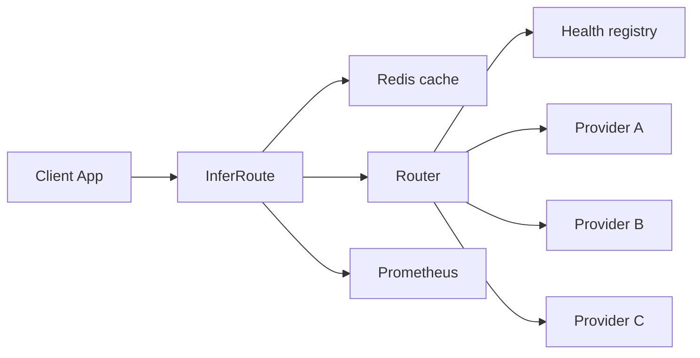

# InferRoute

InferRoute is an asynchronous LLM inference gateway that routes model requests across multiple endpoints while accounting for latency, provider health, caching, retries, and failure recovery.

An application that talks to several model providers should not own timeout policy, health tracking, fallback, caching, and metrics on its own. InferRoute sits in front of those endpoints and gives every caller one OpenAI-shaped API.

## Architecture



Route handlers validate HTTP and delegate. `InferenceService` owns the request. The router is the only component that orders providers. Static provider config stays separate from runtime health.

```text
request
  → cache lookup
  → route to a healthy provider
  → retry, then fall back if the error is retryable
  → cache write when the request is eligible
  → metrics and structured log
  → response
```

## Reliability

Each provider is `healthy`, `degraded`, or `unhealthy`.

| Consecutive failures | Status |
|---|---|
| 0–1 | healthy |
| 2 | degraded |
| 3 or more | unhealthy, then a 30 second cooldown |

Thresholds and the cooldown are environment settings. Unhealthy providers are left out of normal routing. After the cooldown, a background probe calls `GET /health` on that endpoint. A successful probe restores it without treating the probe as an inference latency sample. A failed probe refreshes the cooldown.

Retryable failures are timeouts, connection errors, and HTTP 429, 500, 502, 503, and 504. Each provider is retried at most `max_retries` times (default 1), with delay `base * 2^(retry-1) + jitter`. The base delay is 50 ms. A 400 or 422 stops the loop: another provider will not fix a bad request. If every candidate fails, the client receives `all_providers_unavailable` or `provider_timeout`, with `request_id`, and no stack trace.

Redis failures are logged and ignored. Inference continues.

## Routing

`ROUTING_STRATEGY=round_robin` rotates the first choice across eligible providers: A, B, C, A, B, C.

`ROUTING_STRATEGY=latency_aware` (the default) scores each eligible provider. Lower is better.

```text
normalized_latency = ewma_latency_ms / 1000
score = 1.0 * normalized_latency
        + 0.5 * consecutive_failures
        + health_penalty
```

`health_penalty` is 0 for healthy and 1 for degraded, so being degraded costs as much as 1000 ms of latency. Providers with no samples use a 500 ms prior, so a brand-new endpoint does not look instantaneously faster than the others. Providers that share the best score rotate, which keeps identical endpoints sharing traffic.

Latency is an exponentially weighted moving average:

```text
EWMA_new = 0.2 * latest_latency + 0.8 * EWMA_old
```

The first sample becomes the average. After that, recent calls move the score more than old history, so a provider that just became slow is demoted without waiting for a lifetime average to catch up. For streams, the sample is time to first token.

## Caching

The cache key is `inferroute:response:` plus the SHA-256 of a canonical JSON document: model, messages, temperature, and max tokens. Key order is stable, so the same logical request hits the same entry. The default TTL is 300 seconds.

Only `temperature == 0` and non-streaming requests are eligible. Warmer sampling bypasses the cache so a stochastic generation is not replayed as if it were deterministic. Responses carry `X-InferRoute-Cache: HIT`, `MISS`, or `BYPASS`.

A short Redis lock (`SET NX`) keeps a burst of identical misses from all calling the provider at once. Waiters re-read the cache briefly, then proceed if the entry is still missing.

## Streaming

`stream: true` returns Server-Sent Events:

```text
data: {"token":"Distributed"}

data: {"token":" systems"}

data: [DONE]
```

Time to first token is the time from the start of inference until the gateway has the first token. It is returned in `X-InferRoute-TTFT-Ms`. That is not the same number as total stream duration, which is logged when the stream finishes.

Fallback is allowed only before that first token. After a token has been sent, a provider failure ends the stream with `stream_interrupted` and is not replayed. Replaying would append a second model's answer onto the first model's tokens.

## Local development

```bash
git clone https://github.com/TechAfranie-X/infer-route.git
cd infer-route
docker compose up --build
```

| Service | Port |
|---|---|
| InferRoute | 8000 |
| Redis | 6379 |
| Mock provider A | 8081 |
| Mock provider B | 8082 |
| Mock provider C | 8083 |

Mock latency and failure rates:

| Provider | Baseline latency | Failure rate |
|---|---:|---:|
| A | 150 ms | 2% |
| B | 300 ms | 1% |
| C | 100 ms | 10% |

```bash
curl -s http://localhost:8000/v1/chat/completions \
  -H 'content-type: application/json' \
  -d '{"model":"general","messages":[{"role":"user","content":"Explain distributed systems simply."}],"temperature":0.7,"max_tokens":200,"stream":false}'
```

Repeated calls rotate or, with latency-aware routing, prefer the healthier lower-latency endpoint. Force a provider into `healthy`, `slow`, `failing`, or `offline`:

```bash
curl -s -X POST http://localhost:8081/mock/mode \
  -H 'content-type: application/json' \
  -d '{"mode":"failing"}'
```

That endpoint exists only on the mock processes.

Deterministic cache check:

```bash
curl -s -D - http://localhost:8000/v1/chat/completions \
  -H 'content-type: application/json' \
  -d '{"model":"general","messages":[{"role":"user","content":"Explain distributed systems simply."}],"temperature":0,"max_tokens":200}'
```

The first response is `X-InferRoute-Cache: MISS`. The second identical call is `HIT`.

Stream:

```bash
curl -N http://localhost:8000/v1/chat/completions \
  -H 'content-type: application/json' \
  -d '{"model":"general","messages":[{"role":"user","content":"Explain distributed systems simply."}],"stream":true}'
```

Outside Docker:

```bash
python3 -m venv .venv
source .venv/bin/activate
pip install -e ".[dev]"
python scripts/run_mock_providers.py
```

Point `config/providers.json` at `http://127.0.0.1:8081` and the matching ports, then `make dev`.

## Testing

```bash
make test
make lint
```

Health, routing, cache, fallback, and streaming tests use in-process providers. They do not need Redis or Docker. `httpx2` is installed for Starlette's test client. The gateway's outbound client is `httpx`.

## Load tests

```bash
locust -f load_tests/locustfile.py --host http://localhost:8000
```

```bash
locust \
  -f load_tests/locustfile.py \
  --host http://localhost:8000 \
  --headless \
  -u 100 \
  -r 10 \
  -t 2m
```

Scenarios are `baseline`, `cache`, `streaming`, `provider_slow`, and `provider_failure`. See [load_tests/README.md](load_tests/README.md). Measured runs are recorded in [docs/benchmark-results.md](docs/benchmark-results.md).

## Request trace

This matches the default provider settings: one local retry, then fallback. Times are illustrative of the order of events, not a recorded benchmark.

```text
12:00:00.000  request received
12:00:00.003  cache MISS
12:00:00.005  router selects provider-a
12:00:00.210  provider-a times out
12:00:00.212  failure recorded, consecutive_failures = 1
12:00:00.262  local retry of provider-a after backoff
12:00:00.470  provider-a times out again
12:00:00.472  consecutive_failures = 2, status = degraded
12:00:00.474  fallback starts, router selects provider-b
12:00:00.780  provider-b returns the completion

attempts = 3
fallback_used = true
provider = provider-b
```

On a stream, fallback stops once the first token has been written to the client. A later failure emits `stream_interrupted` and records `stream_failed`.

## Tradeoffs

**Latency versus reliability.** The lowest EWMA is not always the right choice. A fast provider with consecutive failures is penalized, and a degraded provider pays a fixed penalty so a healthy endpoint wins unless it is about a second slower.

**Retries versus tail latency.** A retry raises the chance of success and also adds the failed attempt plus backoff to the client's latency. That shows up in p95 and p99 even when the average still looks fine. Retries are capped per provider, and the whole request has an inference timeout.

**Cache freshness versus hit rate.** A 300 second TTL avoids repeat provider calls for identical temperature-0 prompts. It can also return an older completion after the upstream model or prompt policy changes.

**Streaming versus transparent fallback.** After the first token, the gateway cannot silently switch providers without corrupting the answer. The client sees a terminated stream instead of a mixed one.

**Active health checks versus real traffic.** A `/health` probe can succeed while inference is slow or failing. Cooldown recovery uses the probe; routing decisions during normal traffic use inference latency and failures.

**One gateway versus many replicas.** Health, EWMA, and the round-robin cursor live in the process. Ten replicas would each learn health from their own traffic, so a provider could look healthy on one replica and unhealthy on another. The cache is already shared through Redis. Sharing health would mean a Redis or other consensus-backed registry, or accepting independent decisions per replica.

## How this would scale

```text
                    Load balancer
                         |
        +----------------+----------------+
        |                |                |
  InferRoute 1     InferRoute 2     InferRoute 3
        |                |                |
        +----------------+----------------+
                         |
                       Redis
                         |
            Provider A  Provider B  Provider C
```

Horizontal scaling is straightforward for stateless request handling and for the cache. The pieces that are still local are health, in-flight retry policy, and per-process metrics. Production growth would add shared health or a deliberate choice that each replica decides alone, per-provider rate limits and concurrency caps, aggregated metrics, and possibly request hedging for the slowest tail. Consistent hashing would matter if cache affinity or sticky sessions were required. None of that is implemented here.

## Future work

These are not implemented:

- Weighted and cost-aware routing
- Token-cost and quality scoring
- Request hedging
- Distributed health state
- Semantic caching
- Per-provider rate and concurrency limits
- OpenTelemetry tracing and Grafana dashboards
- Kubernetes manifests
- Model-specific queues
- Dynamic provider registration

## Configuration

See [.env.example](.env.example). Provider endpoints are listed in [config/providers.json](config/providers.json). Do not commit secrets. This local stack does not need a paid model API key.
