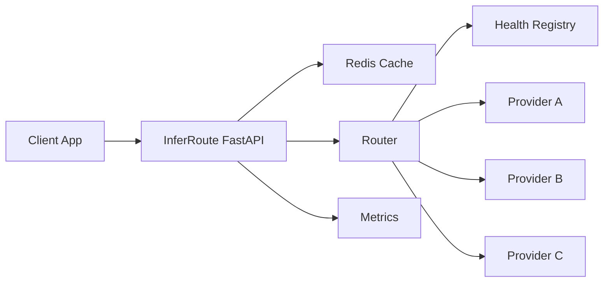

# InferRoute

InferRoute is an asynchronous LLM inference gateway. Applications send model requests to one gateway instead of calling each provider themselves. The gateway will own routing, provider health, retries, fallback, response caching, token streaming, and latency metrics.

This repository is being built milestone by milestone. The gateway rotates chat requests across configured endpoints and records provider latency, failures, and cooldown. Latency-aware routing, retries, caching, streaming, and load tests are still ahead.

## What works now

- FastAPI application with a lifespan that opens and closes a shared async Redis client
- `GET /health` — process liveness. Returns `200` even when Redis is down, and reports Redis as `connected` or `unavailable`
- `GET /ready` — readiness. Returns `200` only when Redis answers `PING`, otherwise `503`
- Structured JSON logs and an `X-Request-ID` header on every response
- Docker Compose stack: InferRoute + Redis

## Target architecture



The API layer will delegate inference to an `InferenceService`. Route handlers will not choose providers. Static provider configuration stays separate from runtime health. Redis failures degrade the cache and do not take inference down.

Planned request path, once the later milestones exist:

```text
request → cache lookup → route to a healthy provider → retry or fall back
        → cache write → metrics → response
```

## Local development

Requirements: Python 3.12+ and Docker.

```bash
python3 -m venv .venv
source .venv/bin/activate
pip install -e ".[dev]"
cp .env.example .env
```

Start Redis, then the gateway:

```bash
docker compose up redis -d
make dev
```

Or start the whole stack:

```bash
docker compose up --build
```

| Service    | Port |
|------------|------|
| InferRoute | 8000 |
| Redis      | 6379 |

```bash
curl -s http://localhost:8000/health
curl -s http://localhost:8000/ready
```

A healthy response looks like:

```json
{
  "status": "ok",
  "service": "inferroute",
  "version": "0.1.0",
  "redis": "connected",
  "environment": "development"
}
```

## Tests

```bash
make test
make lint
```

Health tests inject an in-memory Redis probe. They do not require a running Redis server. The test client uses `httpx2` because current Starlette requires it. The gateway's own HTTP client, added in a later milestone, stays on `httpx`.

## Design notes for this milestone

**Liveness is not readiness.** `/health` stays available when Redis is down so a cache outage is not reported as a dead gateway. `/ready` is what Compose and the image health check use, because this development stack expects Redis to be up before serving.

**No global service singletons.** Settings and the Redis client live on `app.state` and are exposed through FastAPI dependencies. Tests build an app with `create_app(settings, redis_client=...)`.

**Request ids are validated.** A caller may pass `X-Request-ID` only in the form `req_` plus 12 hex characters. Anything else is replaced so logs cannot be broken by header content.
